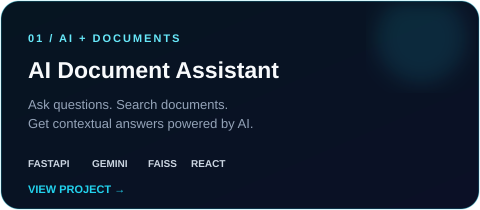
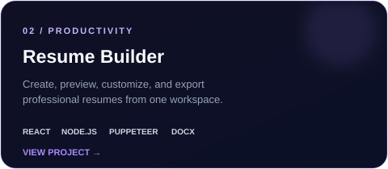
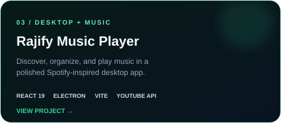
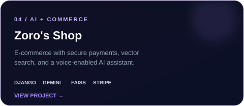

<div align="center">



<br />


<br />

<a href="https://www.linkedin.com/in/rajesh-ravi-22684130b/"></a>
<a href="mailto:ravirajesh988@gmail.com"></a>
<a href="https://github.com/rajeshravi2004/Portfolio"></a>


</div>

## `> whoami`

I am **Rajesh R**, a Full Stack Developer from Tamil Nadu, India. I build practical products across healthcare, AI, real-time systems, and cloud infrastructure—with a focus on clean engineering and experiences people can rely on.

<table>
  <tr>
    <td width="50%">🏥 <strong>Currently building</strong><br />CareScribe healthcare workflows at Mittai Healthcare</td>
    <td width="50%">🤖 <strong>Integrating intelligence</strong><br />LLMs, document analysis, vector search, and automation</td>
  </tr>
  <tr>
    <td width="50%">⚡ <strong>Engineering in real time</strong><br />WebSockets, Pub/Sub, secure APIs, and responsive interfaces</td>
    <td width="50%">☁️ <strong>Shipping reliably</strong><br />Google Cloud, Docker, Kubernetes, and scalable data systems</td>
  </tr>
</table>

> **1+ year of hands-on experience** · Junior Full Stack Developer · BE Information Technology · **8.73 OGPA**

## `> tech --ecosystem`

<div align="center">

`FRONTEND` → `BACKEND` → `AI` → `CLOUD` → `DATA` → `DEVOPS`

<br />


</div>

<details>
<summary><strong>More tools I use</strong></summary>
<br />
REST APIs · WebSockets · Redis · Pub/Sub · Cloud Storage · FAISS · LangChain · Swagger/OpenAPI · Postman · Playwright · Selenium
</details>

## `> projects --featured`

<div align="center">
  <a href="https://github.com/rajeshravi2004/rajesh-chatbot"></a>
  <a href="https://github.com/rajeshravi2004/Resume-Builder"></a>
  <a href="https://github.com/rajeshravi2004/RajAudios"></a>
  <a href="https://github.com/rajeshravi2004/zoroshop"></a>
</div>

## `> experience --timeline`

```text
2025 — NOW   Junior Full Stack Developer  · Mittai Healthcare Private Limited
2025         Fullstack Intern Developer   · Mittai Healthcare Private Limited
2024         AI/ML Internship Scholar     · AIIRF-EDII
2023         UI/UX Internship Scholar     · AIIRF-EDII
```

At **Mittai Healthcare**, I build CareScribe features using React, Node.js, Express, Python, PostgreSQL, WebSockets, Google Cloud Storage, and Pub/Sub. My work spans clinical documentation workflows, LLM integrations, API security, real-time communication, technical documentation, and deployment infrastructure.

## `> github --activity`

<div align="center">
  
  
</div>

<div align="center">
  
</div>

## `> connect`

I am open to full-stack roles, healthcare technology, AI-integrated products, and ambitious teams that care about both engineering quality and real user impact.

<div align="center">
  <a href="mailto:ravirajesh988@gmail.com"><strong>EMAIL ME</strong></a>
  &nbsp;&nbsp;·&nbsp;&nbsp;
  <a href="https://www.linkedin.com/in/rajesh-ravi-22684130b/"><strong>LINKEDIN</strong></a>
  &nbsp;&nbsp;·&nbsp;&nbsp;
  <a href="https://github.com/rajeshravi2004?tab=repositories"><strong>ALL PROJECTS</strong></a>
</div>

<br />


