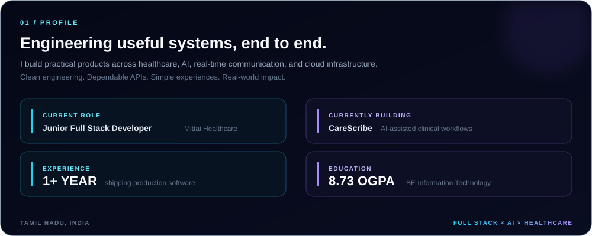
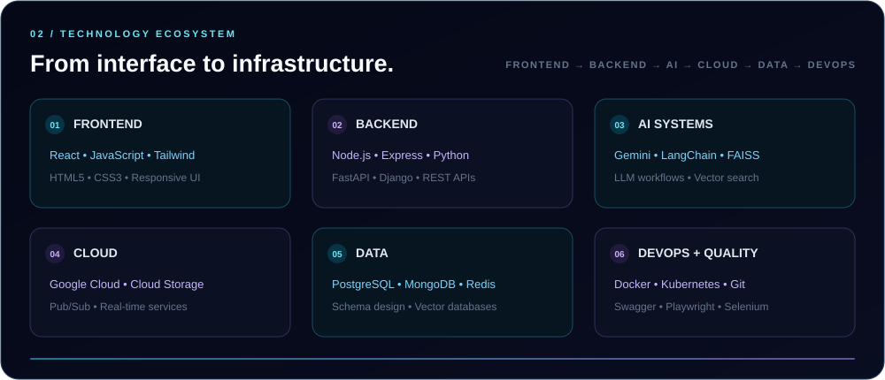
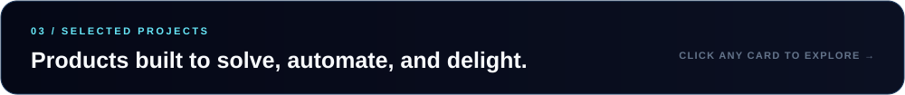
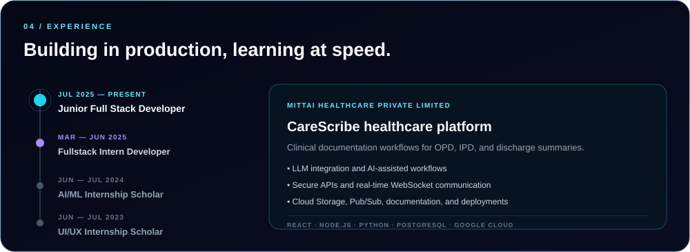

 

  

 

 

  

 

 

  

<strong>Profile details in text</strong>

I am **Rajesh R**, a Full Stack Developer from Tamil Nadu, India, with **1+ year of hands-on experience**. I currently work as a **Junior Full Stack Developer at Mittai Healthcare Private Limited**, building CareScribe healthcare workflows with React, Node.js, Express, Python, PostgreSQL, WebSockets, Google Cloud Storage, and Pub/Sub. I hold a BE in Information Technology from Annamalai University with an **8.73 OGPA**.

I am interested in full-stack roles, healthcare technology, AI-integrated products, and teams that value engineering quality and real user impact.

